# TechNest - Premium Vue 3 Admin Panel

TechNest is a state-of-the-art, high-performance admin dashboard built with **Vue 3**, **Vite**, and **Tailwind CSS**. Designed for developers who demand premium aesthetics and robust functionality, it features a glassmorphism-inspired UI, smooth animations, and a rich library of reusable functional components.


## 📸 Visual Showcase

| | |
|:---:|:---:|
| 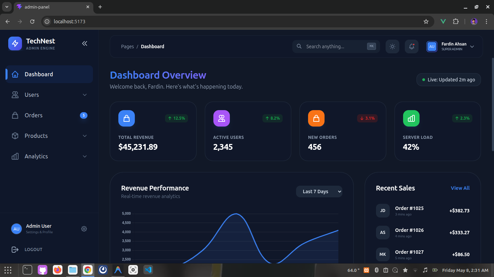 | 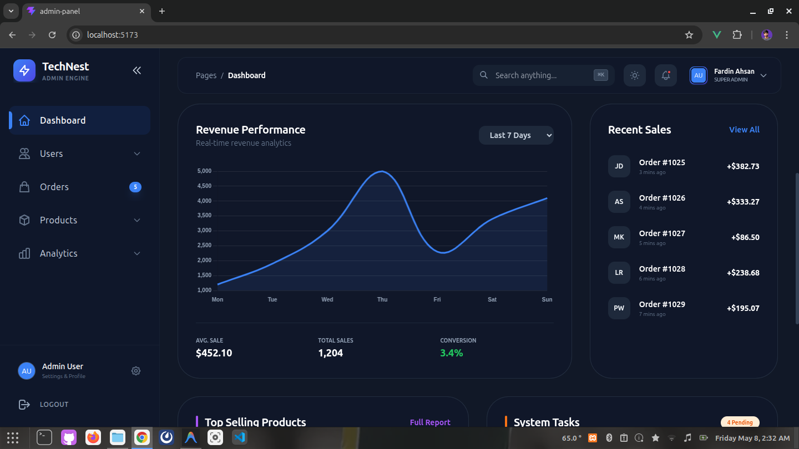 |
| 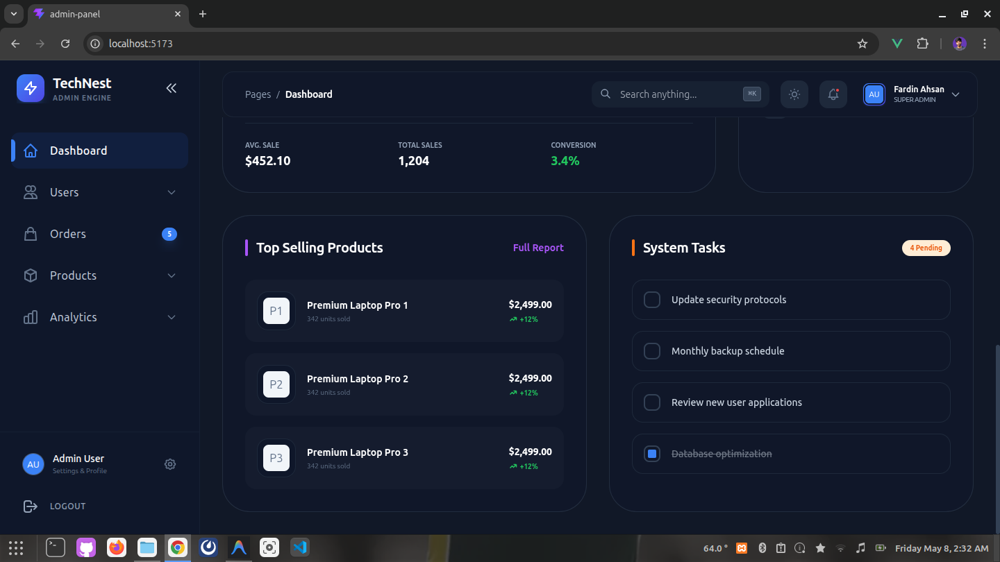 | 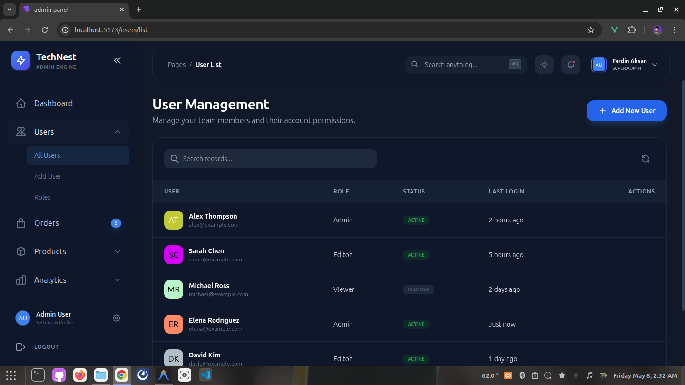 |
| 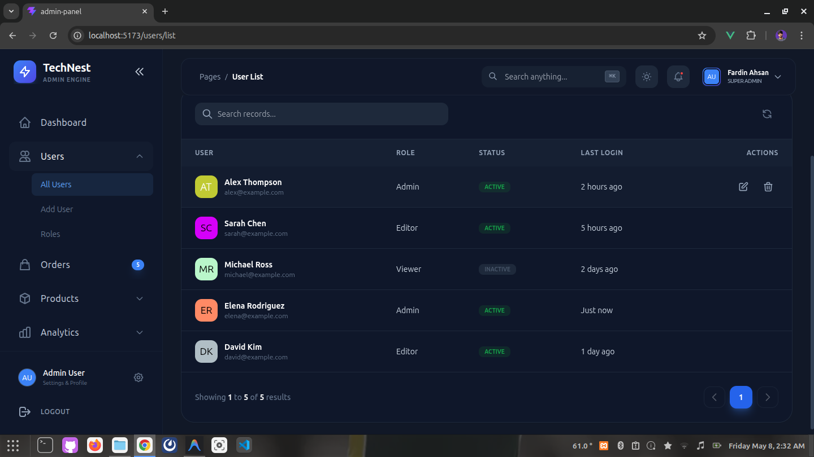 | 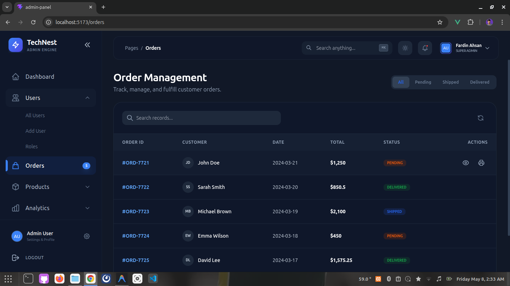 |
| 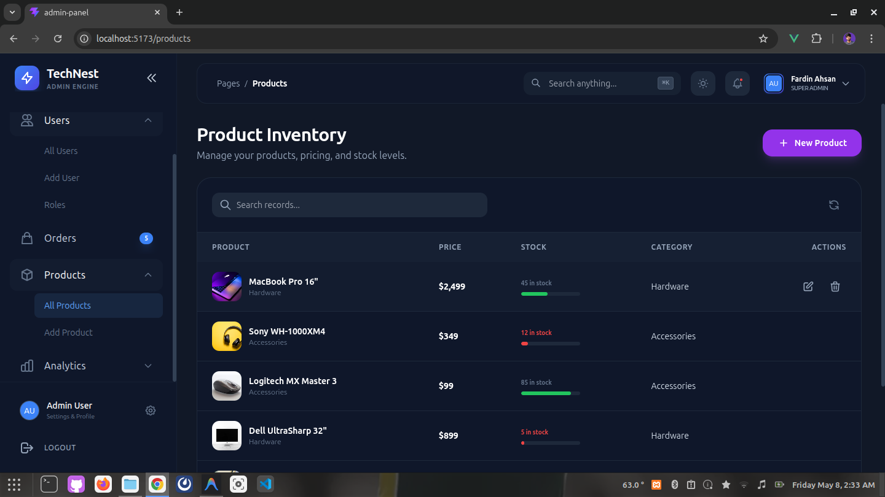 | 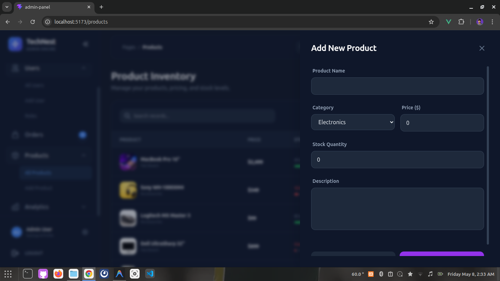 |
| 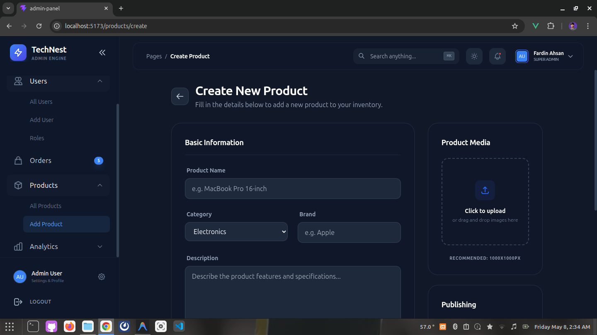 | 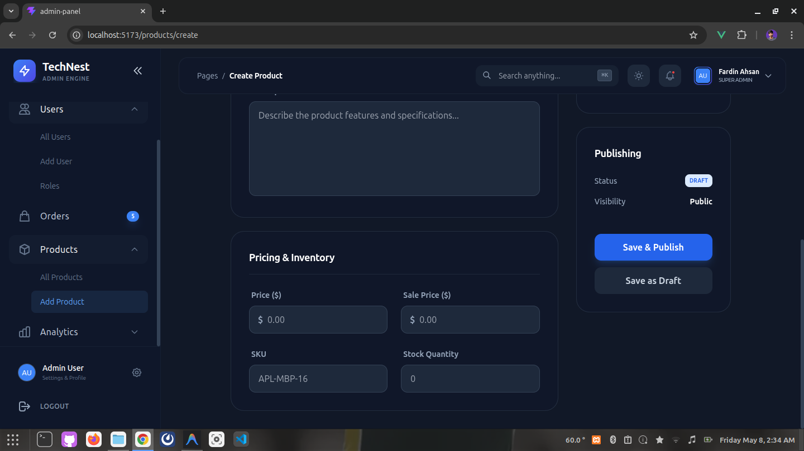 |
| 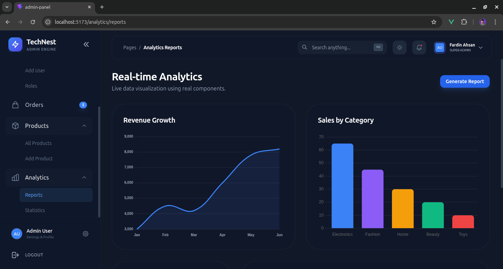 | 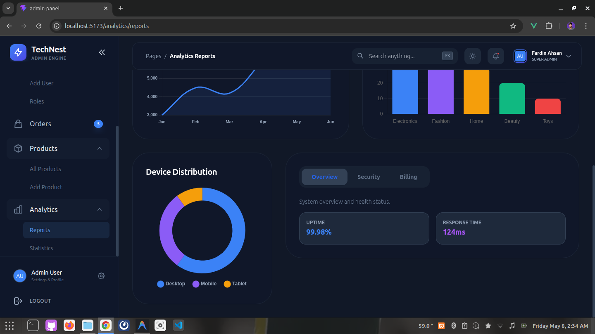 |

## ✨ Features

- **💎 Premium Glassmorphism UI**: A stunning, modern design with backdrop blurs, subtle gradients, and sleek dark mode support.
- **🚀 High Performance**: Built on Vite for lightning-fast development and optimized production builds.
- **📈 Live Analytics**: Integrated **Chart.js** for real-time data visualization (Line, Bar, and Doughnut charts).
- **📋 Advanced Data Tables**: Reusable `DataTable` component with built-in search, pagination, and custom slots.
- **🔔 Global Toast System**: A functional, high-performance notification system with a dedicated composable.
- **✨ Smooth Transitions**: Professional entrance animations and side-panel transitions using Vue's `<Transition>` system and custom cubic-bezier curves.
- **📱 Fully Responsive**: Optimized for all screen sizes, from mobile devices to large desktop monitors.

## 🛠️ Tech Stack

- **Framework**: [Vue 3](https://vuejs.org/) (Composition API + `<script setup>`)
- **Build Tool**: [Vite](https://vitejs.dev/)
- **Styling**: [Tailwind CSS](https://tailwindcss.com/)
- **Routing**: [Vue Router 4](https://router.vuejs.org/)
- **Charts**: [Chart.js](https://www.chartjs.org/) & [Vue-Chartjs](https://vue-chartjs.org/)
- **Icons**: Custom SVG Icon System

## 📂 Project Structure

```text
src/
├── components/
│   ├── ui/             # Reusable functional components (DataTable, Modal, Toast, etc.)
│   ├── layout/         # Sidebar, Navbar, and Main Layout
│   └── icons/          # Custom SVG icon library
├── views/              # Page modules (Dashboard, Users, Products, Analytics, etc.)
├── composables/        # Reusable logic (useToast, etc.)
├── router/             # Vue Router configuration
└── style.css           # Global styles and custom animations
```

## 🚀 Getting Started

### 1. Clone the repository
```bash
git clone https://github.com/FardinFirozKhan/Vue-Custom-Admin-Panel.git
cd Vue-Custom-Admin-Panel
```

### 2. Install dependencies
```bash
npm install
```

### 3. Run development server
```bash
npm run dev
```

### 4. Build for production
```bash
npm run build
```

## 🧩 Key Components

### DataTable
A powerful component for listing data.
```vue
<DataTable :columns="myColumns" :data="myData" :has-actions="true">
  <template #col-status="{ item }">
    <span class="badge">{{ item.status }}</span>
  </template>
</DataTable>
```

### Toast Notifications
Use the global toast system from any component.
```javascript
import { useToast } from '@/composables/useToast'
const toast = useToast()

toast.success('Settings saved successfully!')
```

### SidePanel & Modal
Smooth, high-value dialog components for CRUD operations.
```vue
<SidePanel :is-open="isOpen" title="Add User" @close="isOpen = false">
  <!-- Your Form Here -->
</SidePanel>
```

## 📄 License

This project is open-source and available under the [MIT License](LICENSE).

---

Built with ❤️ by [Fardin Khan](https://github.com/FardinFirozKhan)
